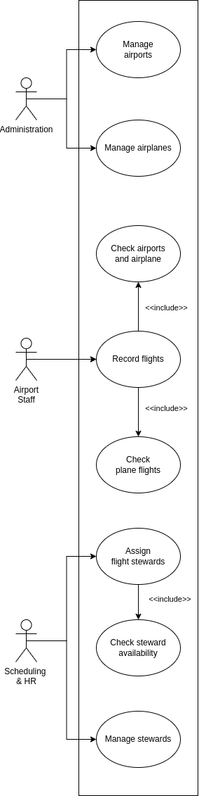
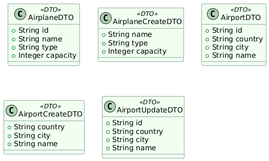
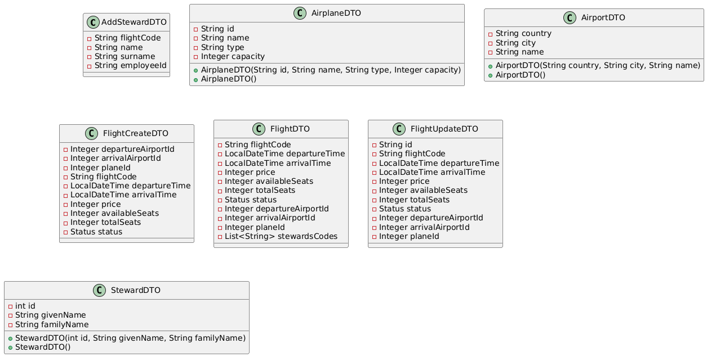
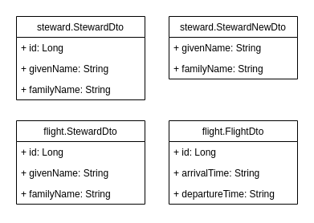

# Airport Manager

Create an information system managing flight records at an airport.

The ultimate goal is to have a system capable of listing flights ordered by date and displaying the flight details.

## Instructions to run
Each service has to be run from its own repository. E.g. I want to run airport-airplane service:
1. `cd .\airport-service`
2. `mvn clean install`
3. `mvn spring-boot:run`

### Running with Docker

To start all services with Docker:

```sh
docker compose up --build
```

## Seeding data

Aiport Manager services contain sample data by default.

To launch a service without sample data locally:

```sh
mvn -f [service] spring-boot:run -Dspring-boot.run.arguments="--seedData=false"
```

To launch services without sample data in Docker:

```sh
SEED_DATA=false docker compose up -d --force-recreate
```

## Monitoring
Grafana is available at http://localhost:3000

Default login: admin / admin

Provisioned dashboard is located at: dashboards/JVM (Micrometer)

## Using authenticated services

Airport Manager services are protected by OAuth2.

A MUNI account is required to use the services.

**To access the services, first generate your OAuth2 token**:

1. Make sure the `auth-gateway` service is running.
    - Start this service locally with `mvn -f auth-gateway/gateway`.
    - Start this service with Docker as `docker compose up auth-gateway`.
2. Visit the Swagger UI at [localhost:8090/swagger-ui.html](http://localhost:8090/swagger-ui.html)
3. Choose `Authorize`.
4. Select your desired privileges under `Scopes`.
5. Press the `Authorize` button.
6. Confirm the prompt and log in with your MUNI account.

**To obtain your OAuth2 token, copy it from the sample API call**:

1. Expand the first item under `Dummy API`.
2. Press the `Try it out` button.
3. Press the `Execute` button.
4. In the `Curl` section under `Responses`, find the line starting with `-H 'Authorization: Bearer`
5. Copy your OAuth2 token from this line and remove any extraneous characters.

**To authenticate yourself against Airport Manager services in Swagger**:

1. Visit the Swagger UI of the target service.
    - See [localhost:8079/swagger-ui/index.html](http://localhost:8079/swagger-ui/index.html), [localhost:8080/swagger-ui/index.html](http://localhost:8080/swagger-ui/index.html) or [localhost:8081/swagger-ui/index.html](http://localhost:8081/swagger-ui/index.html).
2. Choose `Authorize`.
3. Paste your OAuth2 token in the displayed input and press `Authorize`.

**To authenticate yourself against Airport Manager services in cURL**:

Add a header with `-H 'Authorization: Bearer abcdefghi'`, where `abcdefghi` is the token you just obtained.

## Concepts

**Flight details** include origin, destination, departure time, arrival time, plane and list of stewards.

A **destination** should contain at least the information about the location of an airport (country, city).

**Airplane details** should contain the capacity of the plane and its name (and possibly its type as well).

A **steward** is described by his first and last name.

## Requirements

1. The system should allow the users to enter records about stewards, airplanes and destinations.

2. It should also be possible to update and delete these records.

3. The system should also allow us to record a flight.

4. It should also be possible to assign (remove) stewards to (from) a flight while checking for the steward's availability.

## Conditions

1. When recording a flight, it is necessary to set the departure and arrival times, the origin, the destination and the plane.

2. The system should also check that the plane does not have another flight scheduled during the time of the this flight.

## Use Case Diagram



## Microservices

### Airport & Airplane Service

**Description**: A standalone service that maintains all airport and aircraft information. Stores complete airport details (country, city) and airplane specifications (model, capacity, type).

**Path**: [`airport-service`](airport-service)

**Swagger UI**: http://localhost:8080/swagger-ui/index.html

**DTO Class Diagram**:



### Flight Service

**Description**:

The Flight Service is responsible for managing flights within the application. It provides various operations for creating, updating, deleting, and retrieving flight information. The service also allows adding stewards to flights and checking flight availability based on different criteria such as departure and arrival airports, flight status, and available seats.

The service is designed to be used in conjunction with other services, such as the Airport & Airplane Service and the Steward Service, to provide a complete flight management solution.

**Path**: [`flight-service`](flight-service)

**Swagger UI**: http://localhost:8079/swagger-ui/index.html

**DTO Class Diagram**: 

### Steward Service

**Description**: Manage stewards and steward-flight assignments.

**Path**: [`steward-service`](steward-service)

**Swagger UI**: http://localhost:8081/swagger-ui/index.html

**DTO Class Diagram**:




# Locust Test Scenarios

## Scenario 1: Valid User
    
**Goal:**  
Simulate real-world user behavior by fully using the system (creating airports, airplanes, stewards, flights, and viewing flights).

**Description:**  
The user creates multiple airports, airplanes, stewards, and flights in the correct order and views existing flights.

**Expected Results:**
- HTTP `201 Created` responses for successful entity creation.
- HTTP `200 OK` responses when viewing flights.
- Simulates normal system load and expected user behavior.

---

## Scenario 2: Timing Issue User

**Goal:**  
Simulate user behavior by calling APIs in the wrong order.

**Description:**  
The user tries to create a flight without first creating the required dependencies (airport, airplane, steward).  
After encountering failures, the user corrects the flow by creating the missing entities and then successfully creates a flight.

**Expected Results:**
- Initial HTTP `400 Bad Request` or `404 Not Found` for missing dependencies.
- Later HTTP `201 Created` after correcting the missing resources.

---

## Scenario 3: Invalid Data User

**Goal:**  
Simulate users sending invalid or malformed input.

**Description:**  
The user attempts to create a flight with:
- Invalid timing (arrival before departure).
- Insufficient number of stewards (only one steward assigned instead of two).

**Expected Results:**
- HTTP `400 Bad Request` or `422 Unprocessable Entity` for invalid input data.
- Simulates server-side validation errors.
