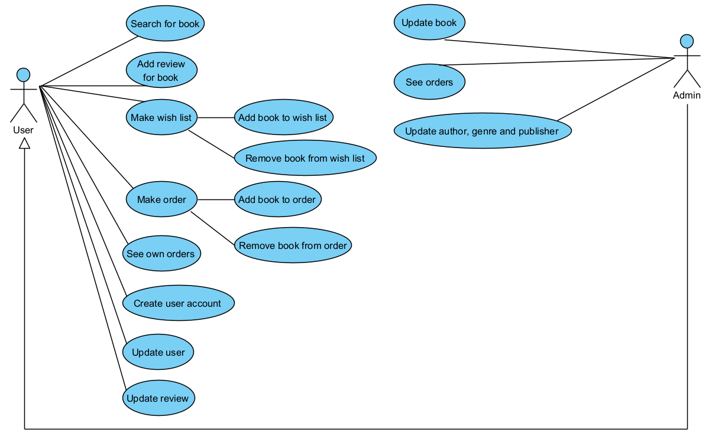
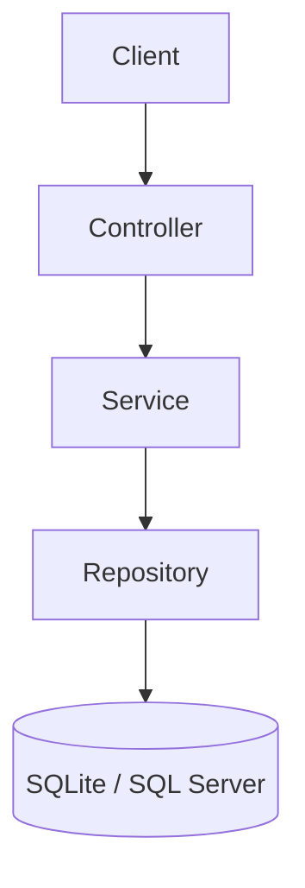
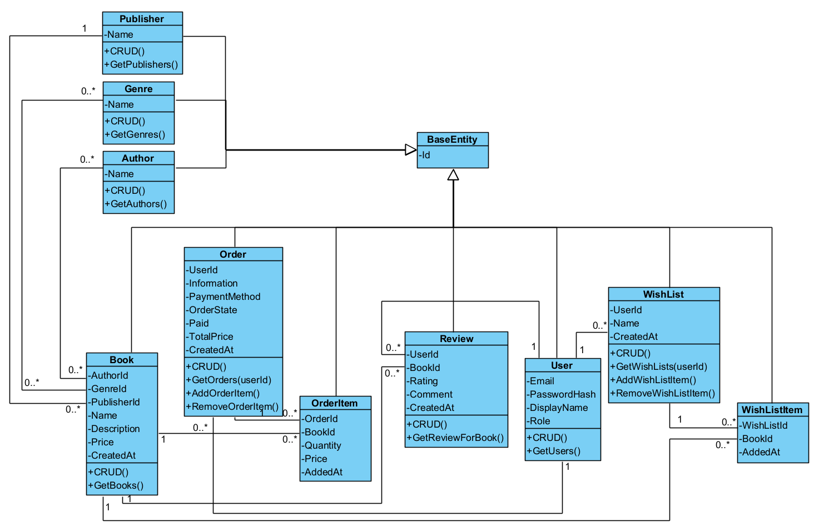

# Technical Overview – BookHub

This document provides a **technical description** of the BookHub application,  
its architecture, components, data model, and internal logic.  
The project was developed as part of **PV179 – Modern Programming Platforms (.NET)** at Masaryk University.

---

## System Overview

BookHub is a simple **Web API** for managing and selling books.  
It provides CRUD operations for books, authors, publishers, and users, and supports additional features such as wish lists, orders, and reviews.  
The system distinguishes between two user roles:

- **User** – can browse books, manage a wish list, place orders, and write reviews.
- **Admin** – can manage catalog data (authors, publishers, genres) and view orders.

The application is built on **ASP.NET Core Web API** and uses **Entity Framework Core (EF Core)** for data access.

---

## Use Case Diagram

<p align="center">
  
</p>

**Description:**
- Regular users can search for books, create wish lists, place and view orders, and write or update reviews.
- Admin users have elevated privileges to manage books, authors, publishers, and genres, and view all orders.

---

## Architecture Overview

### Layered Architecture

| Layer | Description |
|--------|--------------|
| **Presentation (API Layer)** | ASP.NET Core Web API controllers handle HTTP requests and return JSON responses. |
| **Service Layer** | Implements application logic and orchestrates communication between controllers and DAL. |
| **Data Access Layer (DAL)** | Handles database access via Entity Framework Core (repositories, DbContext, migrations). |
| **Database Layer** | SQLite for development, SQL Server planned for production. |

### Architecture Diagram



### Project structure

```text
BookHub/                         # solution root
├─ BookHub.sln                   # solution file
├─ docker-compose.yml            # optional Docker setup (API + DB)
│
├─ BookHub/                      # ASP.NET Core Web API project
│  ├─ Controller/                # API controllers
│  ├─ DTOs/                      # Data Transfer Objects
│  ├─ Extensions/                # DI/config extensions
│  ├─ Mapping/                   # DTO ↔ Entity mapping
│  ├─ Middleware/                # Auth & Logging middleware
│  ├─ Service/                   # Application/services layer
│  ├─ appsettings.json
│  ├─ appsettings.Development.json
│  ├─ BookHub.http
│  ├─ DatabaseConfigExtensions.cs
│  └─ Program.cs
│
├─ DataAccessLayer/              # EF Core data access
│  ├─ Data/                      # DbContext & configs
│  ├─ Enums/
│  ├─ Models/                    # Entities
│  ├─ Repository/                # Repositories
│  ├─ IUnitOfWork.cs
│  └─ UnitOfWork.cs
│
├─ docs/
│  ├─ diagrams/
│  │  ├─ UseCase.png
│  │  └─ ERD.png
│  └─ TECHNICAL_OVERVIEW.md
│
└─ README.md
```


---

## Data Model

<p align="center">
  
</p>

| Entity | Description |
|-------|-------------|
| **Book** | Represents a book record (title, price, description, author, publisher, genre). |
| **Author / Publisher / Genre** | Define book metadata; all have CRUD operations. |
| **User** | Represents a registered user, storing email, password hash, role, etc. |
| **Order** | Contains user’s orders and associated **OrderItems**. |
| **Review** | Stores user feedback on books. |
| **WishList** | Allows users to save favorite books. |
| **WishListItem** | Connects books with a specific wish list. |

---

## Middleware Components

| Middleware | Description |
|------------|-------------|
| **AuthenticationMiddleware** | Verifies presence of the `BookHub-Token` header with value `BookHub-Token-Dev`. Rejects unauthorized requests (**401**). |
| **LoggingMiddleware** | Logs all incoming HTTP requests (method, path, timestamp) to console. Useful for debugging and audit. |

Both middlewares are registered in `Program.cs` and applied globally.

---

## API Endpoints Overview

This project follows a REST style with resource-based routing.  
For the full, always up-to-date list see **Swagger UI** → `http://localhost:5000/swagger`.

| Resource       | Endpoints (examples)                                                                                                                                                                        |
|----------------|---------------------------------------------------------------------------------------------------------------------------------------------------------------------------------------------|
| **Books**      | `GET /api/books`, `GET /api/books/{id}`, `POST /api/books`, `PUT /api/books/{id}`, `DELETE /api/books/{id}`                                                                                 |
| **Authors**    | `GET /api/authors`, `GET /api/authors/{id}`, `POST /api/authors`, `PUT /api/authors/{id}`, `DELETE /api/authors/{id}`                                                                       |
| **Publishers** | `GET /api/publishers`, `GET /api/publishers/{id}`, `POST /api/publishers`, `PUT /api/publishers/{id}`, `DELETE /api/publishers/{id}`                                                        |
| **Genres**     | `GET /api/genres`, `GET /api/genres/{id}`, `POST /api/genres`, `PUT /api/genres/{id}`, `DELETE /api/genres/{id}`                                                                            |
| **Orders**     | `GET /api/orders`, `GET /api/orders/{id}`, `POST /api/orders`, `PUT /api/orders/{id}`, `DELETE /api/orders/{id}`                                                                            |
| **Reviews**    | `GET /api/books`, `GET /api/books/{id}`, `POST /api/books`, `PUT /api/books/{id}`, `DELETE /api/books/{id}`                                                                                 |
| **WishLists**  | `GET /api/wishlists`, `GET /api/wishlists/{id}`, `POST /api/wishlists`, `PUT /api/wishlists/{id}`, `DELETE /api/wishlists/{id}`, `POST /api/wishlists/items`, `DELETE /api/wishlists/items` |

---

## Testing and Validation

- **Manual testing via Swagger UI** – verify requests/responses interactively.
    - URL: `http://localhost:5000/swagger` (adjust port if needed)
    - Project includes `BookHub.http` with sample requests.
- **CRUD verification** – each controller tested for create/read/update/delete happy paths and typical errors.
- **Middleware validation** –
    - *Authentication:* requests **without** `BookHub-Token` return `401 Unauthorized`.
    - *Logging:* incoming requests are logged (method, path, timestamp) to console.
  
---

## References

- README.md
- ASP.NET Core Documentation
- Entity Framework Core Documentation

